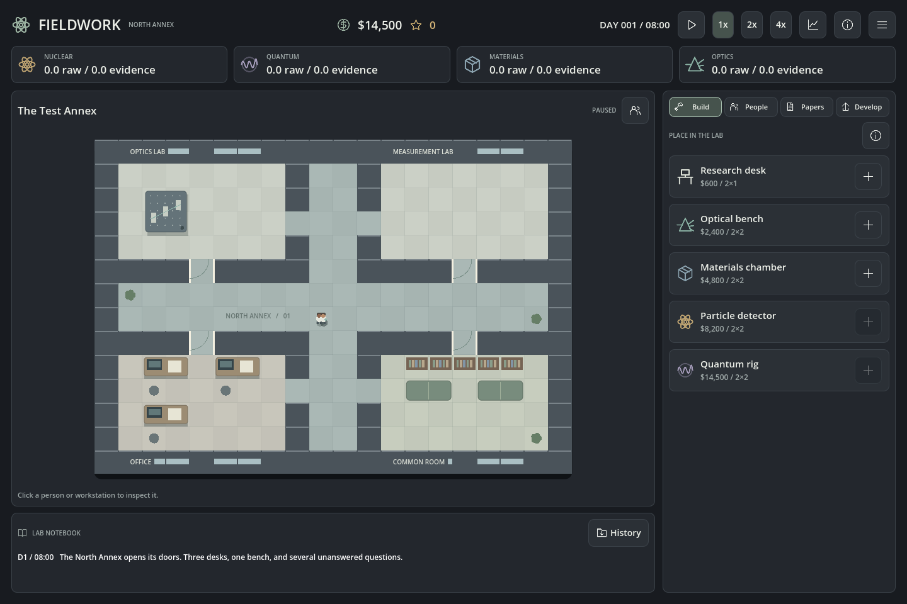

# Fieldwork — iteration 3

A Godot prototype about managing a physics laboratory: collect data, analyze it, write papers, then use publication funding and impact to develop the lab.

## Play

Double-click **Play.command**. Choose **New laboratory** or **Load laboratory** from the main menu. Existing running copies must be restarted to pick up this iteration.

To edit the project, open **project.godot** in Godot and press **F5**. Built and tested with Godot 4.7.2 and the compatibility renderer; no plugins or external libraries required.

The lab starts paused. **Space** resumes; **Esc** opens the pause menu. A day lasts **48 real seconds at 1x**, twice as long as iteration 2. Keys **1 / 2 / 3** select **1x / 2x / 4x**. People walk at half the previous visual speed at 1x.



## This iteration

- A restrained charcoal and sage interface, distinct icons for nuclear, quantum, materials, and optics, and a larger laboratory view. Detailed explanations live in tooltips and information popups.
- A fixed building with two experiment rooms, an office, a common room, doors, and corridors. Experiments occupy **2×2** tiles. Desks occupy **2×1**, with a chair tile below. Construction keeps workstations reachable.
- Physical desk assignments. Analysis, writing, and study require reaching a free chair; one person uses each desk per work hour. Staff path around walls and furniture. People can pass through each other.
- Staff portraits, a compact roster, and individual detail panels with a draggable daily schedule. Assign rest, collection, analysis, activity, data focus, experiment, and desk.
- Experiment activity, moving people, working screens, and resting/studying/writing indicators animate while time runs.
- A lab notebook with varied activity-based flavor, low-energy observations, worn-equipment hints, and specialist moments. These events have no gameplay effects.
- Common, rare, and legendary paper cards with separate field icons, colored borders, and discovery reveals. The writing banner explains missing time or desks before evidence is committed.
- A main menu, pause menu, five named save slots, a separate autosave, and load selection.
- Resource history for funds, raw data, analyzed evidence, and publication income. Daily samples support 30-day, 90-day, and full-history views, with hover values.

## First playtest

1. Resume and watch the team walk to the bench and desks. The two founding students collect optics and later analyze it. The researcher studies while there is no manuscript.
2. Click a person or open **People** to inspect their routine. Drag a boundary or edit hours. Gold hours run the selected **Activity**; **Auto** writes when a manuscript needs work and studies otherwise.
3. Accumulate **18 optics evidence** and open **Papers**. Commit 100–200% of the required evidence. A letter starts at 62% acceptance; double evidence raises it to 94% and increases writing work by 20%.
4. Start the manuscript. Writers work during scheduled activity at a physical desk. Peer review begins when writing finishes. Its outcome pauses time and shows a titled result; closing it leaves the lab paused.
5. Accepted papers grant funds and impact. Rejection returns 75% of the committed evidence and restores the idea. Shelving before review returns the full dataset but loses writing progress.
6. Spend eight study points on **Discover**. Free an idea slot by discarding an unwanted idea. **Journal club**, once unlocked, replaces the six-card board for twelve points and reveals its highest-tier idea.
7. Build more equipment or desks and try existing **Develop** upgrades. Space expansion, research routes, and longer-term objectives are reserved for later iterations.

A controlled founding-team run reached the first manuscript after **155 lab hours**, about **5 minutes 10 seconds at 1x**. Actual timing varies with traits, assignments, travel, and evidence commitment. The larger layout makes travel meaningful; this remains a playtest tuning point.

## Ideas and fields

Random discoveries use a **55% common / 30% rare / 15% legendary** base roll. After seven consecutive non-legendary random draws, the next is legendary. Journal club's random cards share that protection; its guaranteed basic cards do not consume it. The effective legendary frequency is consequently higher than 15% over long runs.

Appearance has no lifetime-impact gate. Starting an article still requires two lifetime impact; starting a high-impact paper requires seven. Later research-route requirements are not implemented.

| Equipment | Primary data | Secondary data after mixed-mode upgrade |
| --- | --- | --- |
| Optical bench | Optics | Quantum |
| Materials chamber | Materials | Optics |
| Particle detector | Nuclear | Materials |
| Quantum rig | Quantum | Nuclear |

Mixed-mode acquisition is an existing permanent development. It applies to level 2+ experiments: 75/25 primary/secondary at level 2, 60/40 at level 3. It also enables newly generated advanced ideas that require two types of evidence.

## Saves

Use **Esc → Save laboratory** or **Cmd+S / Ctrl+S** to choose one of five named slots. Overwriting an occupied slot asks for confirmation. Autosave runs every five lab days and when returning to the main menu or quitting an active lab. Starting at the main menu never overwrites a save.

Godot stores these files in this game's `user://` directory, accessible through **Project → Open User Data Folder** in the editor:

- `fieldwork_autosave_v3.json`
- `fieldwork_slot_1_v3.json` through `fieldwork_slot_5_v3.json`

Load selection also offers previous `fieldwork_lab_v2.json` and `fieldwork_lab.json` saves when present. Originals are left untouched. Old experiments are repositioned into the fixed building, and staff receive the starting desks. If an older lab has more equipment than fits, unplaced equipment is refunded at its base purchase price. Iteration 1 untyped data becomes optics; its unfinished manuscripts return their original evidence.

Saves restore paused and retain typed data, furniture, staff traits, schedules, review draws, pending decisions, resource history, and discovery protection. The random review draw is fixed when writing starts, so loading does not reroll it.

## Controls

| Action | Control |
| --- | --- |
| Pause / resume | Space or top play/pause icon |
| Speed | 1, 2, 3 for 1x, 2x, 4x |
| Pause menu / close popup | Esc |
| Place desk or experiment | Build card's plus icon, then a valid floor tile |
| Cancel placement | Esc or right-click |
| Inspect | Click a person, desk, or experiment |
| Larger map area | People icon in the laboratory heading hides/shows management |
| Save chooser | Cmd+S / Ctrl+S or pause menu |
| Resource history | Chart icon or pause menu |
| Help | H or information icon |

## Project and checks

- `scripts/simulation.gd`: hourly agents, resources, papers, navigation, and saves.
- `scripts/catalog.gd`: fields, equipment, staff traits, journal tiers, and developments.
- `scripts/lab_layout.gd`: fixed rooms, furniture footprints, chairs, and interaction cells.
- `scripts/lab_floor.gd`: map drawing, animated equipment, staff movement, and selection.
- `scripts/main.gd`, `ui_kit.gd`: management interface and menus.
- `scripts/portrait.gd`, `schedule_view.gd`, `resource_chart.gd`: portraits, timeline, and history graph.
- `scripts/lab_events.gd`: contextual flavor templates and recent-template filtering.
- `docs/design-plan.md`: mechanics, balance notes, and next playtest questions.

Run from this folder:

```sh
/Applications/Godot.app/Contents/MacOS/Godot --headless --path . --script res://tests/test_simulation.gd
/Applications/Godot.app/Contents/MacOS/Godot --path . --script res://tests/test_ui.gd
```

The interface suite renders screenshots into `docs/screenshots/`; add `--headless` to skip image capture. Tests disable autosave and use separate temporary test slots. Both suites return a nonzero exit code on failed assertions.

**Verification:** 514 simulation checks and 114 interface checks pass, including rendered navigation, publication results, graphs, and full save menus.

This is still a prototype: staff collisions are simplified, the building cannot expand, and the economy and travel times need player feedback.

## Version control

The local Git repository uses `main`. Godot source assets, their import settings, and `.gd.uid` files are tracked. Editor caches, exports, temporary test saves, and generated screenshots are ignored. The README preview is a curated tracked image; older screenshots remain locally in `docs/archive/`.

After a change, run the relevant checks above and inspect `git diff` before committing. The `origin` remote is [Alecompa/physics-lab-managment-game](https://github.com/Alecompa/physics-lab-managment-game).
