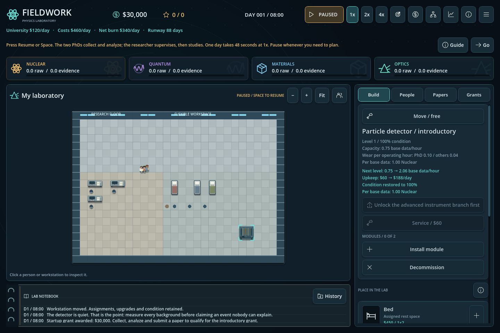

# Fieldwork, versione 6: persone, programmi e spazio

Implementazione dei blocchi 2 e 3 autorizzata l'11 settembre 2026. Stato: implementato, da sottoporre a playtest umano. Le altre parti della roadmap restano pianificate.

- Supervisione assegnabile in People: due PhD per ricercatore, due ore Activity effettive alla scrivania per studente al giorno. La copertura ricevuta oggi determina la produttività di domani, dal 60% al 100%. Le ore rimanenti tornano all'Activity selezionata.
- Usura solo durante acquisizione produttiva: 0,10 punti/ora per PhD e 0,04 per gli altri. Nessuna usura passiva giornaliera. Tecnici da 1,2 punti di riparazione/ora, altri ruoli da 0,45; Service costa in proporzione al danno, minimo $60.
- Griglia iniziale 28×20 senza vincoli di stanza, arredi e strumenti spostabili gratuitamente, zoom, pan e Fit. Velocità di viaggio da 4 a 24 caselle per ora; il tempo residuo resta disponibile per lavorare.
- Espansioni da endgame. Campus planning costa 18 impact dopo Advanced instrumentation e milestone 3. Ali da $45.000 e $75.000, rispettivamente 34×24 e 40×24; la seconda richiede la major discovery.
- Detector, rig quantum o camera materiali introduttiva secondo il programma. Capacità iniziale identica di 18/giorno, upkeep $60/giorno, specializzazioni e idee coerenti. La prima milestone richiede il campo scelto. Gli strumenti avanzati restano sbloccabili tramite tecnologia.
- Introduzioni e testi delle milestone specifici per dark matter, logical qubits e superconduttività. Guida aggiornata per supervisione e mappa.
- Salvataggi schema 6, con migrazione dei v5 e copia originale `.v5-backup` prima della prima sovrascrittura. Si conservano nomi dei file, fondi, strumenti e milestone già raggiunte.

Verifiche: 67 controlli funzionali dedicati, 16 UI con rendering e 42 su avvii e squadre; regressioni di simulazione, progressione, funding, UI ed economia passate. I 18 avvii controllati hanno tempistiche equivalenti fra i tre programmi a parità di seed. 29/30 scenari di espansione moderata arrivano al giorno 75. Vedi [design e risultati](../progression-design.md).

La build browser corrente si genera con `python3 tools/export_web.py` in `exports/fieldwork-v6-web-itch.zip`. Verificati via HTTP locale: caricamento di una partita v5, zoom e navigazione, salvataggio, ricaricamento della pagina e Continue con giorno, fondi ed evidence conservati; nessun errore o avviso nella console. La guida riconosce anche lo strumento ottico delle vecchie partite. La versione pubblicata in precedenza su itch.io resta la v5 finché non si carica questo nuovo file. La verifica delle espansioni comprende acquisto, navigazione, piazzamento, UI e salvataggio; la loro convenienza economica in una partita endgame completa richiede ancora playtesting.
