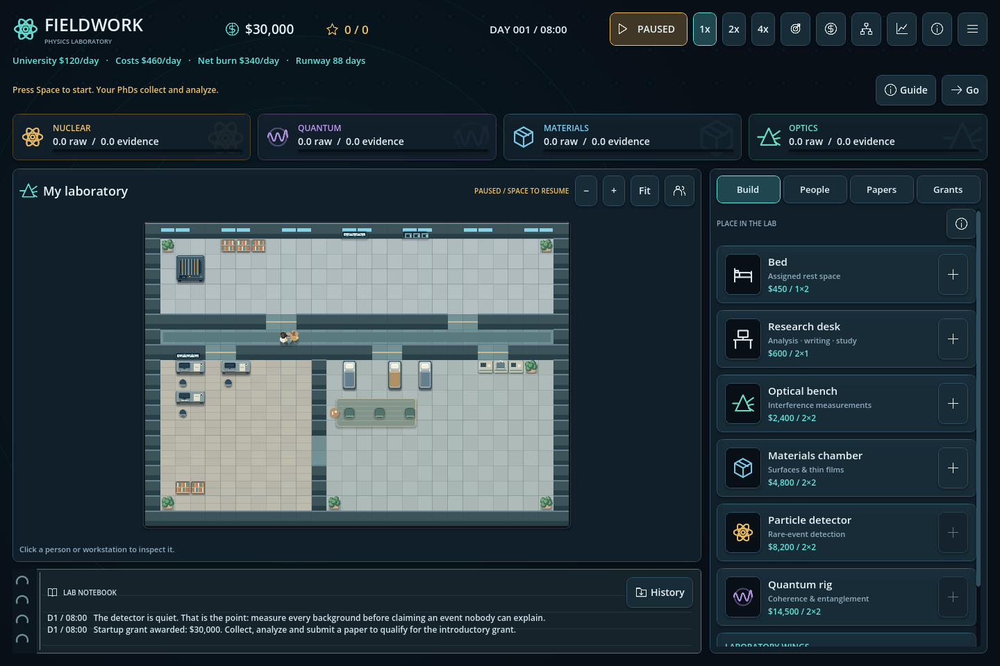

# Fieldwork, versione 7: priorità e vita in laboratorio

- Activity con priorità individuale Papers first o Grants first. Passaggio automatico all'altro lavoro, poi allo studio. Anche il tempo residuo dopo una conclusione o la supervisione viene usato. Le proposal si inviano ancora manualmente.
- Tre stanze arredate e un corridoio sulla griglia 28×20, con porte ampie, piante, scaffali, lavagne, cucina e angolo comune. Rimossi i testi sui muri. Zoom, pan, spostamento degli elementi ed espansioni rimangono disponibili.
- Space Flight di wipics come musica ambient e Interface Sounds di Kenney per interazioni, pubblicazioni, scoperte e grant. File CC0 inclusi localmente, volumi separati e mute in Settings. [Crediti](../../assets/audio/CREDITS.md).
- Testi brevi; effetti dei tratti, formule e dettagli nei tooltip. Restano visibili costi, requisiti bloccanti, scadenze e avvisi sulla cassa.
- Schema salvataggi 7. V5 e v6 mantengono la propria pianta e ricevono una copia di backup prima della sovrascrittura. Per provare le tre stanze iniziare una nuova partita.

55 controlli dedicati passati anche con rendering; regressioni funzionali e UI passate. 30/30 scenari automatici di espansione moderata arrivano al giorno 75, e gli avvii dei tre programmi restano equivalenti a parità di seed. Sono verifiche controllate, non partite complete umane. La checklist di playtest è nel [design document](../progression-design.md).

Build browser: `exports/fieldwork-v7-web-itch.zip`, da caricare manualmente su itch.io. Nessun upload o commit automatico.

Verifica web via HTTP locale: caricamento e risalvataggio di una partita v6, conservazione della pianta e delle risorse dopo reload, musica a 0% ed effetti a 24% conservati nelle preferenze. Nessun errore o avviso nella console. File audio e crediti verificati anche dentro il pacchetto esportato. Il comfort d’ascolto prolungato e lo storage nell’iframe pubblico di itch.io restano da provare sul sito.
