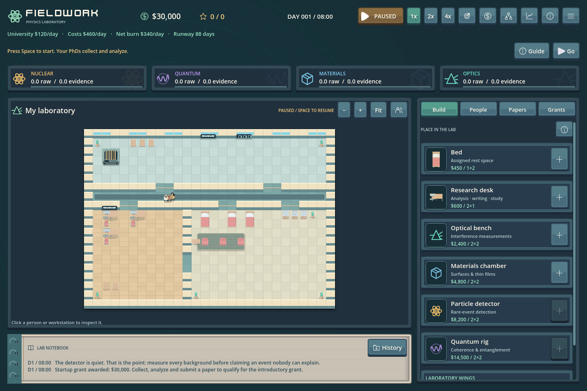

# Fieldwork, versione 8: arredi e interfaccia

La versione 8 rinnova l'aspetto del laboratorio con tre pacchetti Kenney CC0: Furniture Kit, UI Pack e Cursor Pack. [Crediti, licenze e sorgenti](../../assets/kenney/CREDITS.md).

- Dieci sprite di arredi, con scrivanie complete di computer, letti, sedie, poltrone, scaffali, piante e cucina. Derivano da modelli 3D renderizzati in PNG; il gioco rimane 2D.
- Pavimenti chiari, legno caldo, muri color crema e strumenti coordinati con la nuova palette.
- Pulsanti in rilievo, cornici scalabili, menu, tooltip, slider, checkbox e barre di avanzamento. Font Kenney Future nei titoli, font leggibile nei testi.
- Cursori dedicati per selezione, oggetti interattivi, trascinamento e piazzamento. Le schede Bed e Research desk mostrano gli arredi effettivi.
- Quaderno chiaro con rilegatura e testo scuro. Pannelli, albero tecnologico e ritratti condividono la palette verde petrolio.

L'aggiornamento grafico si applica anche ai salvataggi esistenti. Economia, ingombri, accessi, supervisione e schema dei salvataggi restano quelli della versione 7. I blocchi successivi della roadmap attendono il playtest.

Build browser: `exports/fieldwork-v8-web-itch.zip`. Caricamento su itch.io manuale, seguendo la [guida](../publishing-itch.md).

Nel playtest controllare leggibilità degli oggetti a zoom Fit, precisione dei cursori durante piazzamento e spostamento, distinzione fra pulsanti attivi e disabilitati, tooltip e testo alle scale 100–130%. Le licenze sono incluse nella build; i modelli sorgente e gli strumenti di rendering rimangono nel repository.

Verifiche completate: 141 controlli UI con rendering, 55 controlli di priorità/layout/audio con rendering, 16 controlli UI su supervisione e mappa, 60 controlli funding UI in headless. Schermate esaminate a 1280×800, 1440×960 e 1920×1080, incluse scale UI al 130%. Corretti il bordo inferiore delle cornici e il ritaglio delle barre sottili durante la revisione visiva.

Export release verificato: 9 file nella radice dello ZIP, 11.008.196 byte compressi, archivio integro e file identici alla preview locale. Crediti e licenze presenti nel pacchetto. Nel browser via HTTP locale: caricamento di una partita preesistente, visualizzazione degli arredi, acquisto di un letto, spostamento gratuito e zoom funzionanti; nessun warning o errore nella console. Il test nell'iframe pubblico di itch.io rimane da fare dopo il caricamento.
